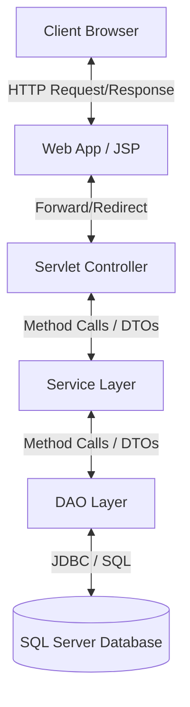
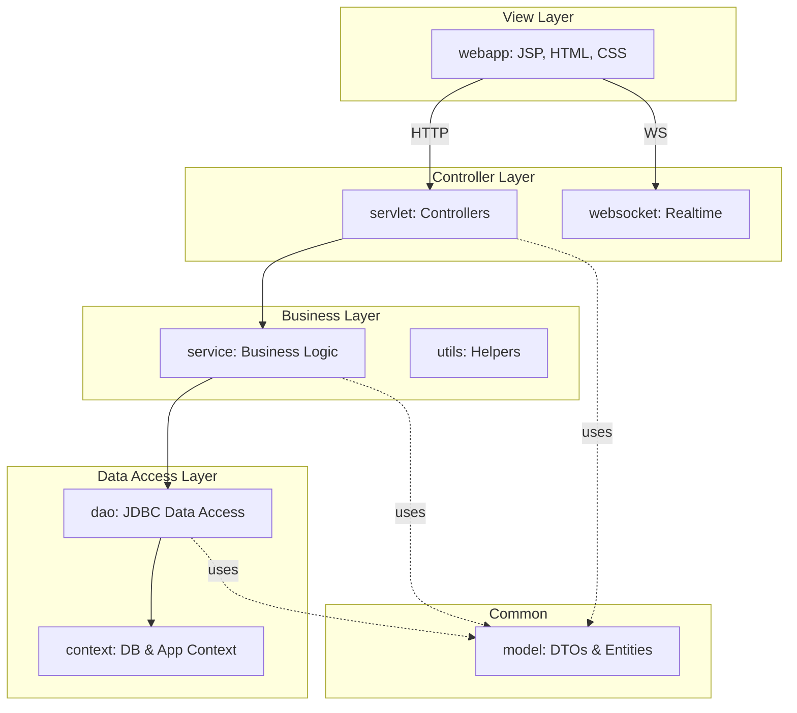
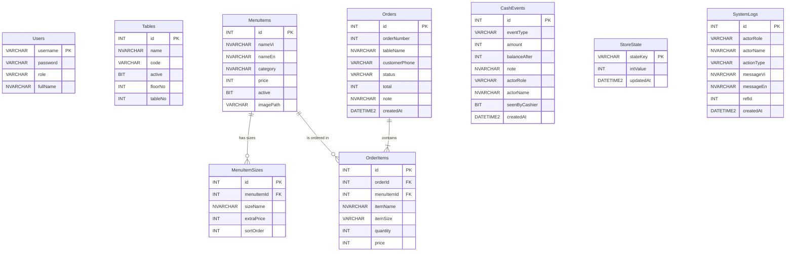

# 1. High Level Design

## 1.1 Software Architecture

## 1.2 Package Diagram

**Package descriptions**

| No | Package | Description |
|---|---|---|
| 01 | `webapp` | Contains all user interface files, including `.jsp` pages and static resources (CSS, JavaScript, Images). This layer interacts directly with the user and sends HTTP Requests to the Controller. |
| 02 | `servlet` | Contains Java classes extending `HttpServlet`. Intercepts incoming requests from the webapp, analyzes user commands, invokes Services for business processing, and directs the response via forward/redirect. |
| 03 | `service` | Houses the core business logic of the system, preventing the Controller from becoming overloaded and handling business rules. |
| 04 | `dao` | Dedicated solely to interacting with the SQL Server database. Encapsulates methods to execute SQL statements (SELECT, INSERT, UPDATE, DELETE) using JDBC. |
| 05 | `model` | Contains Data Transfer Objects (DTOs) or Java Beans. These function as data containers to transport information seamlessly across the Controller, Service, and DAO layers. |
| 06 | `utils` | Consists of shared helper classes utilized globally across the project, adhering strictly to the DRY principle (e.g. JSON utilities, string manipulation). |
| 07 | `context` | Manages the JDBC connection configuration to the database (`DBContext`) and global application context (`AppContext`). |
| 08 | `events` | Server-Sent Events (`GET /api/events`) for realtime order/table updates; client falls back to 5s polling. |

## 1.3 Database Design

### 1.3.1 Users Table
| No | Field | Data type | PK | FK | UN | NN | Description |
|---|---|---|---|---|---|---|---|
| 01 | username | VARCHAR(50) | X | | X | X | Login username and identifier |
| 02 | password | VARCHAR(100) | | | | X | Account password |
| 03 | role | VARCHAR(20) | | | | X | Role of the user (e.g., admin, barista, cashier, runner) |
| 04 | fullName | NVARCHAR(120) | | | | X | Full name of the user |

### 1.3.2 Tables Table
| No | Field | Data type | PK | FK | UN | NN | Description |
|---|---|---|---|---|---|---|---|
| 01 | id | INT | X | | | X | Auto-incrementing table identifier |
| 02 | name | NVARCHAR(60) | | | | X | Name or number of the table |
| 03 | code | VARCHAR(40) | | | | | Unique code for the table |
| 04 | active | BIT | | | | X | Operating status (1: Active, 0: Inactive) |
| 05 | floorNo | INT | | | | | Floor number |
| 06 | tableNo | INT | | | | | Table order number |

### 1.3.3 MenuItems Table
| No | Field | Data type | PK | FK | UN | NN | Description |
|---|---|---|---|---|---|---|---|
| 01 | id | INT | X | | | X | Auto-incrementing menu item identifier |
| 02 | nameVi | NVARCHAR(120) | | | | X | Name of the item in Vietnamese |
| 03 | nameEn | NVARCHAR(120) | | | | X | Name of the item in English |
| 04 | category | NVARCHAR(60) | | | | X | Category of the item (e.g., Coffee, Tea) |
| 05 | price | INT | | | | X | Base selling price |
| 06 | active | BIT | | | | X | Selling status (1: Available, 0: Unavailable) |
| 07 | imagePath | VARCHAR(255) | | | | | URL/path to the item's image |

### 1.3.4 MenuItemSizes Table
| No | Field | Data type | PK | FK | UN | NN | Description |
|---|---|---|---|---|---|---|---|
| 01 | id | INT | X | | | X | Auto-incrementing size identifier |
| 02 | menuItemId | INT | | X | | X | References MenuItems(id) |
| 03 | sizeName | NVARCHAR(20) | | | | X | Name of the size (e.g., S, M, L) |
| 04 | extraPrice | INT | | | | X | Additional price for this size |
| 05 | sortOrder | INT | | | | X | Display sort order |

### 1.3.5 Orders Table
| No | Field | Data type | PK | FK | UN | NN | Description |
|---|---|---|---|---|---|---|---|
| 01 | id | INT | X | | | X | Auto-incrementing order/invoice identifier |
| 02 | orderNumber | INT | | | X | | Unique order tracking number |
| 03 | tableName | NVARCHAR(60) | | | | X | Name of the table for the order |
| 04 | customerPhone | VARCHAR(20) | | | | | Customer's phone number |
| 05 | status | VARCHAR(30) | | | | X | Current status of the order (e.g., Pending, Completed) |
| 06 | total | INT | | | | X | Total payable amount |
| 07 | note | NVARCHAR(255) | | | | | Additional notes for the order |
| 08 | createdAt | DATETIME2 | | | | X | Timestamp when the order was created |

### 1.3.6 OrderItems Table
| No | Field | Data type | PK | FK | UN | NN | Description |
|---|---|---|---|---|---|---|---|
| 01 | id | INT | X | | | X | Auto-incrementing order item detail identifier |
| 02 | orderId | INT | | X | | X | References Orders(id) |
| 03 | menuItemId | INT | | | | X | ID of the ordered menu item |
| 04 | itemName | NVARCHAR(120) | | | | X | Name of the item at the time of order |
| 05 | itemSize | VARCHAR(20) | | | | | Size of the item at the time of order |
| 06 | quantity | INT | | | | X | Ordered quantity |
| 07 | price | INT | | | | X | Price per unit |

### 1.3.7 CashEvents Table
| No | Field | Data type | PK | FK | UN | NN | Description |
|---|---|---|---|---|---|---|---|
| 01 | id | INT | X | | | X | Auto-incrementing cash event identifier |
| 02 | eventType | VARCHAR(30) | | | | X | Type of cash event (Income/Expense) |
| 03 | amount | INT | | | | X | Transaction amount |
| 04 | balanceAfter | INT | | | | X | Drawer balance after the transaction |
| 05 | note | NVARCHAR(255) | | | | | Transaction notes |
| 06 | actorRole | VARCHAR(20) | | | | | Role of the person executing the transaction |
| 07 | actorName | NVARCHAR(120) | | | | | Name of the person executing the transaction |
| 08 | seenByCashier | BIT | | | | X | Whether the event has been seen by the Cashier |
| 09 | createdAt | DATETIME2 | | | | X | Timestamp of the event |

### 1.3.8 StoreState Table
| No | Field | Data type | PK | FK | UN | NN | Description |
|---|---|---|---|---|---|---|---|
| 01 | stateKey | VARCHAR(50) | X | | X | X | Key identifier for the state (e.g., cupsAvailable) |
| 02 | intValue | INT | | | | X | Integer value of the state |
| 03 | updatedAt | DATETIME2 | | | | X | Timestamp of the last update |

### 1.3.9 SystemLogs Table
| No | Field | Data type | PK | FK | UN | NN | Description |
|---|---|---|---|---|---|---|---|
| 01 | id | INT | X | | | X | Auto-incrementing system log identifier |
| 02 | actorRole | VARCHAR(20) | | | | X | Role of the actor |
| 03 | actorName | NVARCHAR(120) | | | | | Name of the actor |
| 04 | actionType | VARCHAR(40) | | | | X | Type of action logged |
| 05 | messageVi | NVARCHAR(400) | | | | X | Log message in Vietnamese |
| 06 | messageEn | NVARCHAR(400) | | | | X | Log message in English |
| 07 | refId | INT | | | | | Reference ID for related tables (if any) |
| 08 | createdAt | DATETIME2 | | | | X | Timestamp of the log creation |
